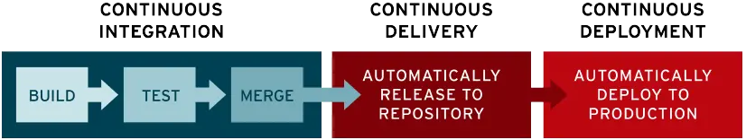

# CI/CD (lab extension)

*NOTE: This is an extension to the [REST_API lab](../REST_API/README.md). The extension requires that the application has been dockerized.*

## 1. Introduction

CI/CD stands for Continuous Integration, Continuous Delivery and Continuous Deployment. It is a set of practices that aims to automate the building, testing and deployment of software applications. CI/CD is the backbone of a DevOps methodology, bringing developers and IT operations teams together to deploy software. **Continuous Integration** refers to the process of automatically building, testing, and integrating code changes into a shared repository. **Continuous Delivery** refers to making code changes available for release (e.g. by uploading the application to a container registry). **Continuous Deployment** refers to automatically releasing code changes to production (e.g. deploying a new application version to a Kubernetes cluster). 

<p align="center">
  
</p>

There are multiple tools to implement these practices (e.g. Jenkins). Here, for convenience, we will only use some of GitLab's CI/CD functionality.

## 2. Tasks

We are going to carry out a small test to get an idea of ​​the type of tasks involved in CI/CD. In summary, we will perform the following tasks:

1) Create a repository for the carrental REST API in GitLab.
2) Install a GitLab Runner in your machine, register it and run it. 
3) Create a .gitlab-ci.yml file at the root of your repository. This file is where you define the CI/CD jobs. 
4) Modify the .gitlab-ci.yml file to achieve that every time there is a commit, the Docker image is (1) rebuilt and (2) uploaded to a container registry.

## 3. Help step by step

*NOTE: You cand find more information about GitLab CI/CD [here](https://docs.gitlab.com/ee/ci/)*

### 3.1 Create a repository for the carrental REST API in GitLab

*NOTE: A minimal knowledge about git is assumed here. Ask for help otherwise.* 

1) Sign in into repo.fib.upc.es and create a public repository (you could name it "carrental") for the carrental REST API.

2) In a terminal, move to, e.g., your home directory and clone the repository using the HTTPS link you will find in GitLab.
```
	cd
	git clone https://repo.fib.upc.es/USERNAME/carrental.git
```
*NOTE: If you get a gnutls_handshake error try the first solution [here](https://stackoverflow.com/questions/60262230/fatal-unable-to-access-gnutls-handshake-failed-handshake-failed).* 

3) Copy or move the files from the REST API lab into the root of the repository (including the Dockerfile). For instance (asuming you have myapp in your home directory):
```
	mv myapp carrental
```	
4) Enter the repo and check the contents
```
	cd carrental
	ls
```
The repo should have the following structure:

```
	myapp
		Dockerfile
		server.js
		package.json
```
5) Add a .gitignore at the root of the repo with this content to avoid uploading to the repo the application dependencies:
```
	node_modules/
```
6) Configure git to be able to run commands and to avoid entering the credentials many times:
```
	git config --global user.name "FIRST_NAME LAST_NAME"
	git config --global user.email "USERNAME@upc.edu"
	git config --global credential.helper store
```
7) Commit and push the changes. 
```
	git add .
	git commit -m "nc"
	git push
```
### 3.2 Installing, registering and running a GitLab Runner

GitLab CI/CD tasks are executed by an application called [GitLab Runner](https://docs.gitlab.com/runner/). The runner can be hosted in GitLab servers but here, for convenience, you will run it your machine. 

1) Install GitLab Runner in your machine following [this instructions](https://docs.gitlab.com/runner/install/).

2) Install a runner in your machine following the instructions in: 

	Settings > CI / CD > Runners > Project runners > New project runner

In the Tags section select "Run untagged". Ignore the other fields and click Create runners.

3) Follow the instructions to register the runner for your project (select "shell" as executor).

4) Check that the runner status in Settings > CI / CD > Runners

*NOTE: If the runner is not active execute "gitlab-runner run" in the terminal.*

5) In your terminal, add gitlab-runner to the docker group:
```
	sudo usermod -aG docker gitlab-runner
```
6) Execute the following to avoid the error "ERROR: Job failed: prepare environment" in Ubuntu:
```
	sudo rm -r /home/gitlab-runner/.bash_logout
```

<!--
2) Follow the instructions to register the runner for your project (select "shell" as executor). Obtain the $REGISTRATION_TOKEN from Settings > CI / CD > Runners.

3) Check that the runner status in Settings > CI / CD > Runners

*NOTE: If the runner is not active execute "gitlab-runner run" in the terminal.*

4) In your terminal, add gitlab-runner to the docker group:
```
	sudo usermod -aG docker gitlab-runner
```
5) Execute the following to avoid the error "ERROR: Job failed: prepare environment" in Ubuntu:
```
	sudo rm -r /home/gitlab-runner/.bash_logout
```
-->
### 3.3 Define a CI/CD pipeline

CI/CD tasks are often grouped around the concept of a [pipeline](https://docs.gitlab.com/ee/ci/pipelines/index.html). A pipeline is a specification of CI/CD tasks (jobs) structured in stages. You do that by including a .gitlab-ci.yml file in the root of your project repo. 

1) Create a test .gitlab-ci.yml file with the following content:

```
test:
 script:
  - echo "Hello, World!" 
```

Commit and push the change to the repo. This will trigger the pipeline. Check the result of the pipeline in Build > Pipelines. Click the pipeline number, then click over the "test" job. You should see the output.

2) Modify .gitlab-ci.yml to automate the building of the Docker image:

```
build:
 script:
  - docker build  -t carrental myapp
test:
 script:
  - docker run --name carrental -d -p 8080:8080 -p 8443:8443 carrental
  - sleep 1
  - curl --request GET  "localhost:8080"
  - docker stop carrental
  - docker rm carrental
```
*NOTE: The curl test assumes you still have the hello world endpoint at /.*

Commit and push the change to the repo. Check the result of the different jobs of the pipeline. 

*NOTE: If the pipeline fails, you would need to stop and remove the container manually before testing it again.*

3) Push the Docker image to a registry

Ideally you would push the image to the GitLab Container Registry but it's not enabled for the FIB's GitLab. Let's try it by launching a local registry. In the terminal type:

	docker run -d -p 5000:5000 --restart=always --name registry registry:2

*NOTE: See [this](https://docs.docker.com/registry/deploying/) for more information about launching a registry server.*

Now change .gitlab-ci.yml this way:

```
build:
 script:
  - docker build  -t carrental myapp
test:
  script:
   - docker run --name carrental -d -p 8080:8080 -p 8443:8443 carrental
   - sleep 1
   - curl --request GET  "localhost:8080"
   - docker stop carrental
   - docker rm carrental

release-image:
  script:
   - docker tag carrental:latest localhost:5000/carrental 
   - docker push localhost:5000/carrental
   - docker image remove localhost:5000/carrental
   - docker pull localhost:5000/carrental
```
Commit, push and check the output. 

### 4 Submission

Just include screenshots of the commands output in the main report.
