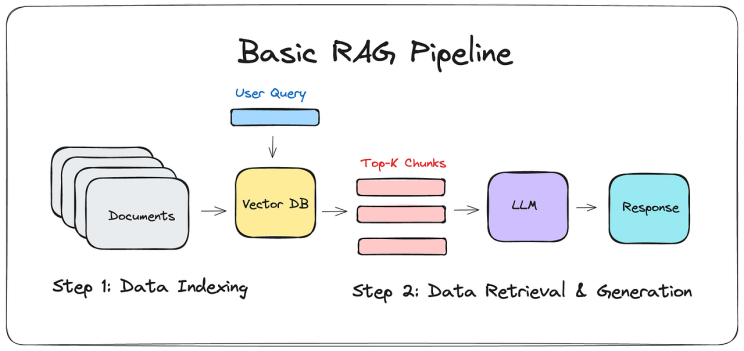

# Creating a chatbot for the car rental shop

## 1 Introduction

We will customize the tutorial **Build AI RAG Chatbot with Ollama and LangChain** available [here](https://www.linkedin.com/pulse/build-ai-rag-chatbot-ollama-langchain-mohammad-oghli-dj4ff/) to extend our car rental application.

## 2 Preparing the environment

We will work with a virtual Python environment. Being in the folder `chatbot_car_rental`, create the virtual environment called `envchatbotcarrental`:

    python3 -m venv envchatbotcarrental

It will create a folder with that same name in your local directory.

Activate the virtual environment with: 

    source envchatbotcarrental/bin/activate

After activating you will see (envchatbotcarrental) added to your current command line in your terminal.

The existing chatbot code needs several packages to be installed. The packages are listed in the `requirements.txt` file. 

Install the packages with pip3:

    pip3 install -r requirements.txt
    

The chatbot uses **Retrieval-Augmented Generation (RAG)**, a technique that enhances the capabilities of a large language models (LLMs) by combining it with external knowledge. 

To use RAG, pip3 installed components of the LangChain framework.

<!--- --->

(source: https://www.linkedin.com/pulse/build-ai-rag-chatbot-ollama-langchain-mohammad-oghli-dj4ff)

### LLM model

As Large Language Models (LLM), we use models from [Ollama](https://github.com/ollama/ollama).

Install Ollama

    curl -fsSL https://ollama.com/install.sh | sh

In Ollama's [git](https://github.com/ollama/ollama) repository, you can see the available models. It is suggested to download the small models llama3.2:1b, llama3.2, and llama3.1, if possible. If your computer has good RAM and GPU capacities, you may also try larger models. 

By default llama3.2 is used in `create_index.py` and `query_index.py`.

    ollama run llama3.2

    ollama run llama3.2:1b
       
    ollama run llama3.1
    
We can check that the models are now available locally:

    ollama list
 
### Dataset 

For the RAG, we need a dataset as external knowledge source. For the tests we have the `rentals.csv` in the `dataset/` folder.

## 3 Running the tutorial

The RAG chatbot is split into two files.

1. `create_index.py` will use an embeddings model to index our dataset `rentals.csv` into a vector store, for which we leverage the LangChain framework. 

2. `query_index.py` will query the indexed dataset and then the LLM will create a response for our prompt based on the retrieved information.

Embedding models create a vector representation of a piece of text. These vectors capture the semantic meaning of the text.
The file `create_index.py` uses the OllamaEmbeddings model.

<!------>

<!---(source: https://www.linkedin.com/pulse/build-ai-rag-chatbot-ollama-langchain-mohammad-oghli-dj4ff)--->

The workflow is distributed as follows:

`create_index.py` for indexing

- Creates the vector store index from our dataset `rentals.csv`
- Creates a saved_index/ directory to store the index
- Saves the index to disk using pickle for persistence
- Only needs to be run once (or to rebuild the index)

`query_index.py` for queries

- Loads the saved vector index from `saved_index/`
- Provides the interactive chatbot interface

After inspecting `create_index.py`, run 

    python3 create_index.py

Check that the generated index is stored in the folder `saved_index/`.

After inspecting `query_index.py`, run

    python3 query_index.py
    

As promt, you can use the default query: 
    
*Can you check which engine types have a low rating?* 

## 4 Experimenting

#### 4.1 Measure duration

Put timestamps into `create_index.py` and `query_index.py` to measure how long it takes for the different models to index and answer queries.

Compare the results.

#### 4.2 Answer quality

Make a query with `query_index.py` to the different models and compare the quality of the results.

#### 4.3 Change dataset representation

Convert the `rentals.csv` into `rentals.pdf` enriched with some text. Modify `create_index.py` to work with `rentals.pdf`.

Modify `query_index.py` to work with the new index and run it. Interpret the result and compare it with previously obtained results.

#### 4.4 RAG vs non-RAG mode

Change `query_index.py` or create a new python file to use the chatbot LLM without RAG (without using the vector index).
Compare the answers obtained with the RAG (using the vector index) and non-RAG version.

#### 4.5 Self-proposed test

Conduct an interesting additional test of your choice. Explain the motivation, run and report it.

## 5 Reporting

Include your files, screenshots of results and comments in the lab report.
