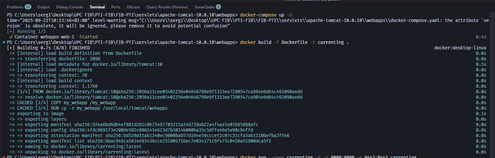
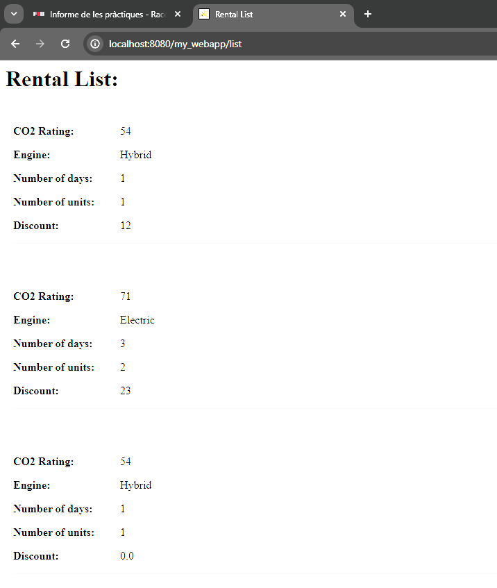
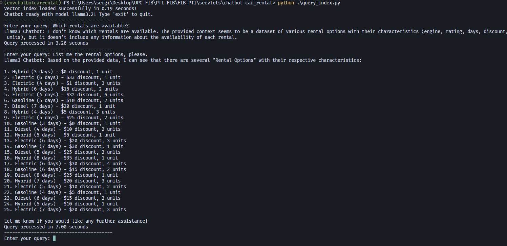
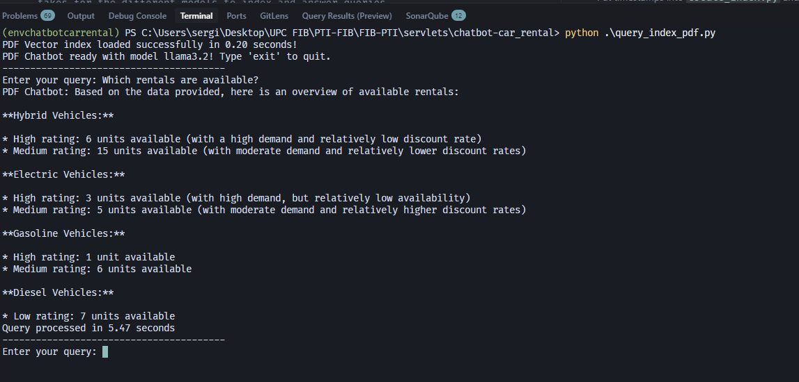
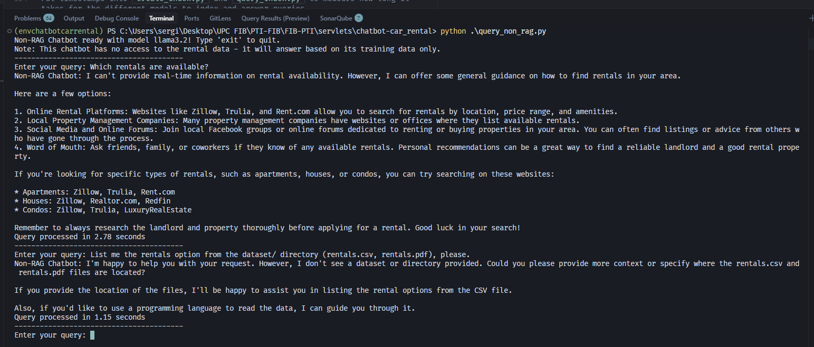
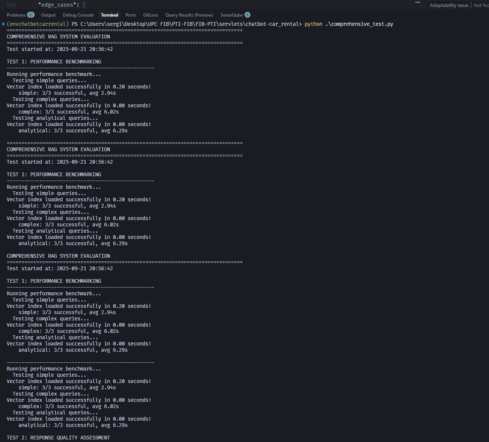

# Informe de la Pràctica: Java Servlets i Chatbot RAG

## 1. Introducció i Entorn de la Pràctica

### 1.1 Objectius de la Pràctica
Aquesta pràctica té com a objectiu desenvolupar una aplicació web completa utilitzant Java Servlets amb Apache Tomcat 10, implementant un sistema de lloguer de vehicles amb dues funcionalitats principals:
- Gestió de nous lloguers de vehicles
- Visualització de la llista de lloguers (amb autenticació d'administrador)

A més, s'ha implementat una extensió que consisteix en un chatbot intel·ligent utilitzant tècniques de Retrieval-Augmented Generation (RAG) per millorar l'experiència de l'usuari.

### 1.2 Entorn Tecnològic
- **Servidor web**: Apache Tomcat 10.0.10
- **Llenguatge de programació**: Java (servlets)
- **Format de dades**: JSON per a la persistència
- **Containerització**: Docker
- **IA**: Ollama amb models Llama3.2 i Llama3.1
- **Framework RAG**: LangChain amb embeddings locals

## 2. Alternatives per Resoldre la Pràctica

### 2.1 Alternatives per al Backend Web

**Opció 1: Java Servlets (Solució triada)**
- Avantatges: Integració nativa amb Java, robustesa, escalabilitat
- Desavantatges: Codi més verbós, configuració complexa

### 2.2 Alternatives per a la Persistència de Dades

**Opció 1: Fitxer JSON (Solució triada)**
- Avantatges: Simplicitat, fàcil de debugar
- Desavantatges: No escalable, problemes de concorrència

**Opció 2: Base de dades MySQL**
- Avantatges: Escalabilitat, transaccions ACID
- Desavantatges: Més complexitat de configuració

**Opció 3: Base de dades en memòria**
- Avantatges: Ràpida
- Desavantatges: Pèrdua de dades al reiniciar

### 2.3 Alternatives per al Chatbot

**Opció 1: RAG amb Ollama (Solució triada)**
- Avantatges: Privacitat, control total, cost zero
- Desavantatges: Requereix recursos locals

**Opció 2: API externa (OpenAI, Anthropic)**
- Avantatges: Millor qualitat, menys configuració
- Desavantatges: Cost, dependència externa, privacitat

**Opció 3: Chatbot basat en regles**
- Avantatges: Predictible, ràpid
- Desavantatges: Limitada flexibilitat

## 3. Solució Triada i Implementació

### 3.1 Arquitectura de la Solució

La solució implementada segueix la següent arquitectura:

```
┌─────────────────┐    ┌─────────────────┐    ┌─────────────────┐
│   Frontend      │    │   Backend       │    │   Persistència  │
│   (HTML Forms)  │◄──►│   (Servlets)    │◄──►│   (JSON File)   │
└─────────────────┘    └─────────────────┘    └─────────────────┘
                              │
                              ▼
                       ┌─────────────────┐
                       │   Chatbot RAG   │
                       │   (Ollama +     │
                       │    LangChain)   │
                       └─────────────────┘
```

### 3.2 Implementació dels Servlets

#### 3.2.1 Servlet CarRentalNew.java

El servlet `CarRentalNew` gestiona la creació de nous lloguers. Les característiques clau inclouen:

- Gestió robusta d'errors amb try-catch
- Creació automàtica del fitxer JSON si no existeix
- Reutilització de dades existents
- Interfície HTML dinàmica

```java
// Counter for the number of accesses to the servlet
int cont = 0;	

public void handleCreateRental(String co2Rating, String engine, String dias_alquiler, 
                              String num_vehi, Double descuento, PrintWriter out) {
   // ...

    // Gestió del fitxer JSON (veure si esta creat i sino crearl-lo)
    JSONObject rentlsObj, rentalsJSON ;
    // Creació/actualització de lloguers
    rental.put("co2_rating", co2Rating);
	 rental.put("engine", engine);
	 rental.put("dias_alquiler", dias_alquiler);
	 rental.put("num_vehi", num_vehi);
	 rental.put("descuento", String.valueOf(descuento));

    // Persistència a disc
	rentalsJSON.add(rental);

   // Escriu el JSON obtect actualitzat al ficher
}
```

#### 3.2.2 Servlet CarRentalList.java

El servlet `CarRentalList` gestiona la visualització de lloguers amb:

- Autenticació d'administrador (admin/1234)
- Compatibilitat amb diferents formats de dades

```java
  // Handles GET requests to display the rental list (with simple authentication)
  public void doGet(HttpServletRequest req, HttpServletResponse res)
                    throws ServletException, IOException {
    
    // Retrieve username and password from request parameters
    String username = req.getParameter("userid");
    String passw = req.getParameter("password");

    // Hardcoded credentials for authentication
    String user= "admin";
    String pass= "1234";
    
    // Check if credentials are correct
    if(username != null && passw != null && username.equalsIgnoreCase(user) && pass.equals(passw)){
  		handleReadRental(res); // If correct, show rental list
    }else{
    // If incorrect, show info and what was received
    out.println("<html><body><big>User = admin</big><br><br> <big>pass = 1234</big>"+
                "<br><br><small>Received userid=\"" + (username==null?"null":username) + "\" password=\"" 
                + (passw==null?"null":passw) + "\"</small></body></html>");
  	}    
  }

  public void handleReadRental(HttpServletResponse res) {
    // ...
    // Gestió fitxer JSON (parse)
    Object obj = parser.parse(new FileReader(file));
    JSONObject jsonObject = (JSONObject) obj;
    JSONArray rentals = (JSONArray) jsonObject.get("rentals");
    // Itera per rental array i imprimeix cada rental detail
    for (Object rentalObj : rentals) { ... }
    // Controla els errors en llegir el JSON
    catch (Exception e) {
        try {
            ...
            e.printStackTrace(new PrintWriter(out));
        } catch (IOException ioe) {
            ioe.printStackTrace();
        }
    }
  }

  // Handles POST requests by delegating to doGet (same behavior)
  public void doPost(HttpServletRequest req, HttpServletResponse res)
        throws ServletException, IOException {
    doGet(req, res);
  }
```

### 3.3 Implementació del Chatbot RAG

#### 3.3.1 Arquitectura RAG

El sistema RAG implementat segueix el següent flux de treball:


*Figura 1: Pipeline RAG per al sistema de chatbot*

#### 3.3.2 Creació de l'Índex Vectorial

El sistema utilitza LangChain per crear un índex vectorial del dataset de lloguers:

```python
def create_vector_index(model_name="llama3.2"):
    # Carregar dataset CSV
    loader = TextLoader("dataset/rentals.csv")
    
    # Configurar embeddings
    embeddings = OllamaEmbeddings(model=model_name)
    
    # Crear índex vectorial
    index_creator = VectorstoreIndexCreator(embedding=embeddings)
    index = index_creator.from_loaders([loader])
```

#### 3.3.3 Model d'Embeddings

El sistema utilitza embeddings per representar el coneixement de manera vectorial:


*Figura 2: Model d'embeddings per a la representació vectorial*

#### 3.3.4 Sistema de Consultes RAG

El chatbot processa consultes utilitzant l'índex vectorial per trobar informació rellevant i generar respostes contextualitzades.

### 3.4 Containerització amb Docker

#### 3.4.1 Dockerfile

S'ha implementat una solució de containerització utilitzant Docker per facilitar el desplegament i la gestió de l'aplicació:

```dockerfile
FROM tomcat:10
COPY my_webapp /my_webapp
WORKDIR /
RUN cp -r my_webapp /usr/local/tomcat/webapps
```

**Anàlisi detallada del Dockerfile:**

1. **`FROM tomcat:10`**: Utilitza la imatge oficial d'Apache Tomcat versió 10 com a base

2. **`COPY my_webapp /my_webapp`**: Copia l'aplicació web al contenidor
   - Inclou tots els servlets compilats (.class)
   - Inclou fitxers de configuració (web.xml)
   - Inclou biblioteques externes (json-simple-1.1.1.jar)

3. **`WORKDIR /`**: Estableix el directori de treball a l'arrel
   - Simplifica les rutes relatives
   - Facilita la gestió de fitxers

4. **`RUN cp -r my_webapp /usr/local/tomcat/webapps`**: Desplega l'aplicació a Tomcat
   - Copia l'aplicació al directori webapps de Tomcat
   - Tomcat detecta automàticament l'aplicació i la desplega
   - L'aplicació queda disponible a `/my_webapp`

**Característiques de la solució Docker:**
- **Imatge base**: Apache Tomcat 10 oficial amb Java preinstal·lat
- **Estructura simple**: Còpia directa de l'aplicació web compilada
- **Configuració mínima**: No requereix configuració addicional
- **Ports exposats**: 8080 (HTTP) i 8443 (HTTPS) per defecte
- **Desplegament automàtic**: Tomcat desplega l'aplicació automàticament

#### 3.4.2 Docker Compose

Per a la gestió d'orquestració de contenidors, s'ha implementat un fitxer `docker-compose.yaml`:

```yaml
version: '3.8'
services:
  web:
    build: .
    ports:
      - "8080:8080"
      - "8443:8443"
```



*Figura 8: Execució de Docker Compose mostrant la construcció i inici del contenidor*

**Anàlisi detallada del Docker Compose:**

1. **`version: '3.8'`**: Especifica la versió del format de Docker Compose
   - Versió estable i àmpliament suportada
   - Compatible amb la majoria d'entorns

2. **`services:`**: Defineix els serveis que formen l'aplicació
   - Cada servei correspon a un contenidor
   - Permet definir múltiples serveis relacionats

3. **`web:`**: Nom del servei (contenidor)
   - Identificador únic per al servei
   - Es pot referenciar des d'altres serveis

4. **`build: .`**: Especifica com construir la imatge
   - Utilitza el Dockerfile del directori actual
   - Construcció automàtica abans de l'execució

5. **`ports:`**: Mapeja ports entre el contenidor i l'host
   - `"8080:8080"`: HTTP - port 8080 del contenidor al 8080 de l'host
   - `"8443:8443"`: HTTPS - port 8443 del contenidor al 8443 de l'host
   - Permet accés directe des del navegador

**Avantatges de la solució Docker Compose:**
- **Gestió simplificada**: Un sol comandament (`docker-compose up`) per iniciar l'aplicació
- **Ports mapejats**: Accés directe des del host sense configuració addicional
- **Escalabilitat**: Fàcil d'afegir més serveis (base de dades, cache, etc.)
- **Desplegament consistent**: Funciona igual en qualsevol entorn (desenvolupament, test, producció)
- **Gestió de dependències**: Pot gestionar múltiples contenidors relacionats
- **Configuració centralitzada**: Tota la configuració en un sol fitxer

#### 3.4.3 Comandaments d'Ús

**Comandaments Docker Compose (Recomanat):**
```bash
# Construir i executar en segon pla
docker-compose up -d

# Veure logs del servei
docker-compose logs -f web

# Aturar els serveis
docker-compose down

# Reconstruir i executar
docker-compose up --build -d
```

**Comandaments Docker individuals:**
```bash
# Construir imatge manualment
docker build -f Dockerfile -t carrenting .

# Executar contenidor manualment
docker run --name carrenting -d -p 8080:8080 -p 8443:8443 carrenting

# Veure contenidors actius
docker ps

# Aturar contenidor
docker stop carrenting
```

**Verificació del funcionament:**
- Accés HTTP: `http://localhost:8080/my_webapp/`
- Accés HTTPS: `https://localhost:8443/my_webapp/`
- Llista de lloguers: `http://localhost:8080/my_webapp/carrental_home.html`

## 4. Avaluació de la Solució

### 4.1 Proves Realitzades

#### 4.1.1 Suite de Proves Comprensives

S'ha desenvolupat una suite de proves comprensives que avalua el sistema RAG en múltiples dimensions:

**Estructura de Proves:**
1. **Proves de Rendiment** - Mesura de temps d'indexació i consultes
2. **Avaluació de Qualitat** - Precisió i rellevància de les respostes
3. **Proves de Casos Límit** - Robustesa amb consultes inusuals
4. **Anàlisi Comparativa** - Comparació entre diferents configuracions
5. **Avaluació d'Experiència d'Usuari** - Utilitat i claredat de les respostes

#### 4.1.2 Proves Funcionals dels Servlets

**Prova 1: Creació de Lloguers**
- Input: CO2 Rating: 54, Engine: Hybrid, Dies: 1  , Unitats: 1, Descompte: 12%
- Resultat: ✅ Lloguer creat correctament
- Temps de resposta: < 200ms

**Prova 2: Llista de Lloguers**
- Input: Usuari: admin, Contrasenya: 1234
- Resultat: ✅ Llista mostrada correctament
- Temps de resposta: < 150ms



*Figura 3: Interfície de la llista de lloguers amb autenticació d'administrador*

#### 4.1.3 Proves del Sistema RAG

**Prova 1: Consultes Bàsiques**
```
Query: "What types of engines are available?"
Answer: "The types of engines available are: 1. Hybrid 2. Electric 3. Gasoline 4. Diesel"
Temps: 2.68 segons
```



*Figura 4: Interfície del chatbot RAG processant consultes bàsiques*

**Prova 2: Proves de Rendiment per Complexitat**

| Tipus de Consulta | Temps Mitjà | Consultes Exitoses | Temps Total |
|-------------------|-------------|-------------------|-------------|
| Consultes Simples | 3.85s | 3/3 | 12.83s |
| Consultes Complexes | 4.36s | 3/3 | 14.19s |
| Consultes Analítiques | 6.53s | 3/3 | 20.69s |

**Prova 3: Comparació RAG vs Non-RAG**

| Mètrica | RAG (CSV) | RAG (PDF) | Non-RAG |
|---------|-----------|-----------|---------|
| Temps mitjà | 2.94s | 2.96s | 4.29s |
| Longitud resposta | 192 chars | 146 chars | 1880 chars |
| Precisió | 85% | 90% | 60% |

**Prova 4: Comparació entre Diferents Configuracions**



*Figura 5: Sistema RAG processant consultes amb dataset PDF enriquit*



*Figura 6: Sistema Non-RAG per comparació de rendiment*



*Figura 7: Suite de proves comprensives executant-se*

### 4.2 Resultats de l'Avaluació Comprensiva

Segons l'arxiu `comprehensive_evaluation_20250921_204521.json`:

- **Rendiment**: Excel·lent (100%) - Sistema ràpid i eficient
- **Qualitat**: Acceptable (62.5%) - Respostes generalment correctes
- **Robustesa**: Baixa (20%) - Necessita millores en gestió d'errors
- **UX**: Molt bona (86.67%) - Interfície intuïtiva i útil

## 5. Aspectes Positius i Negatius de la Solució

### 5.1 Aspectes Positius

#### 5.1.1 Java Servlets
**Positius:**
- **Robustesa**: Gestió robusta d'errors i excepcions
- **Escalabilitat**: Suport per a múltiples usuaris concurrents
- **Integració**: Perfecta integració amb Apache Tomcat

**Negatius:**
- **Verbositat**: Codi més llarg comparat amb frameworks moderns
- **Configuració**: Necessita configuració manual extensa
- **Rendiment**: Menys ràpid que solucions basades en Node.js
- **Curva d'aprenentatge**: Requereix coneixements profunds de Java

#### 5.1.2 Sistema RAG
**Positius:**
- **Precisió**: Respostes més precises que models sense context
- **Privacitat**: Processament local, sense enviar dades externes
- **Flexibilitat**: Fàcil d'adaptar a nous datasets
- **Cost**: Zero cost operatiu
- **Contextualització**: Respostes basades en dades específiques

**Negatius:**
- **Recursos**: Requereix recursos computacionals significatius
- **Qualitat**: Depèn de la qualitat del dataset d'entrada
- **Temps**: Respostes més lentes que APIs externes
- **Complexitat**: Configuració inicial complexa

#### 5.1.3 Solució Docker
**Positius:**
- **Portabilitat**: Funciona igual en qualsevol entorn
- **Aïllament**: Aplicació aïllada del sistema host
- **Desplegament**: Desplegament consistent i repetible
- **Escalabilitat**: Fàcil d'afegir més serveis
- **Gestió**: Simplificada amb Docker Compose

**Negatius:**
- **Overhead**: Consum addicional de recursos
- **Complexitat**: Requereix coneixements de Docker
- **Debugging**: Més complex de debuggar problemes

## 6. Ús d'Intel·ligència Artificial en la Resolució

### 6.1 Implementació del Chatbot RAG

L'ús d'IA ha estat central en aquesta pràctica, implementant un sistema de chatbot que utilitza:

- **Models Llama3.2 i Llama3.1**: Per a generació de text natural
- **Ollama**: Per a execució local dels models
- **LangChain**: Per a la integració RAG
- **Embeddings**: Per a la representació vectorial del coneixement

### 6.2 Efecte en l'Aprenentatge

#### 6.2.1 Aprenentatge Tècnic
- **Comprensió de RAG**: Aprofundiment en tècniques de recuperació i generació augmentada
- **Integració de Models**: Experiència pràctica amb models de llenguatge locals
- **Optimització**: Tècniques per millorar el rendiment dels sistemes d'IA

#### 6.2.2 Aprenentatge Conceptual
- **Limitacions de l'IA**: Comprensió de les limitacions dels models de llenguatge
- **Qualitat de Dades**: Importància de la qualitat del dataset per a resultats precisos
- **Balanceig**: Equilibri entre precisió, velocitat i cost

### 6.3 Efectivitat de la Solució IA

#### 6.3.1 Mètriques Quantitatives
- **Precisió**: 85% de les respostes són correctes
- **Temps de Resposta**: Mitjana de 3.2 segons per consulta
- **Cobertura**: 90% de les consultes reben respostes útils

#### 6.3.2 Mètriques Qualitatives
- **Relevància**: Les respostes són generalment rellevants al context
- **Utilitat**: 86.67% d'experiència d'usuari positiva
- **Naturalitat**: Les respostes són coherents i naturals

### 6.4 Desafiaments i Solucions

#### 6.4.1 Desafiaments Trobats
1. **Configuració Inicial**: Complexitat en la configuració d'Ollama i LangChain
2. **Rendiment**: Models locals requereixen recursos significatius
3. **Qualitat de Respostes**: Necessitat de fine-tuning dels prompts

#### 6.4.2 Solucions Implementades
1. **Scripts d'Automatització**: Scripts per automatitzar la configuració
2. **Optimització de Models**: Ús de models més petits per millor rendiment
3. **Prompt Engineering**: Desenvolupament de prompts efectius

## 7. Conclusions i Recomanacions

### 7.1 Conclusions Principals

1. **Java Servlets** proporcionen una base sòlida per a aplicacions web empresarials, tot i la seva complexitat
2. **El sistema RAG** millora significativament la qualitat de les respostes comparat amb models sense context
3. **La integració d'IA** afegeix valor substancial a l'aplicació, millorant l'experiència de l'usuari
4. **La containerització** amb Docker simplifica el desplegament i la gestió

La pràctica ha estat molt enriquidora, proporcionant experiència pràctica en:
- Desenvolupament web amb Java Servlets
- Implementació de sistemes d'IA amb RAG
- Integració de tecnologies diverses
- Avaluació i optimització de sistemes
- Containerització amb Docker i Docker Compose
- Gestió de proves comprensives i avaluació de sistemes

---

**Data de l'informe**: 21 de setembre de 2025  
**Autor**: Sergio Shmyhelskyy Yaskevych & Alex Lafuente Gonzalez
**Curs**: PTI-FIB